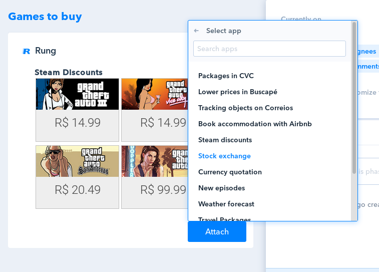

# Pipefy Rung App

> Rung extension for Pipefy (Preact + Custom ES6 version)

## How does it work?

After you enable the Rung App, using the feature `card-buttons`, you should see
a _Rung_ button in the cards of your pipe.

## Screenshots

